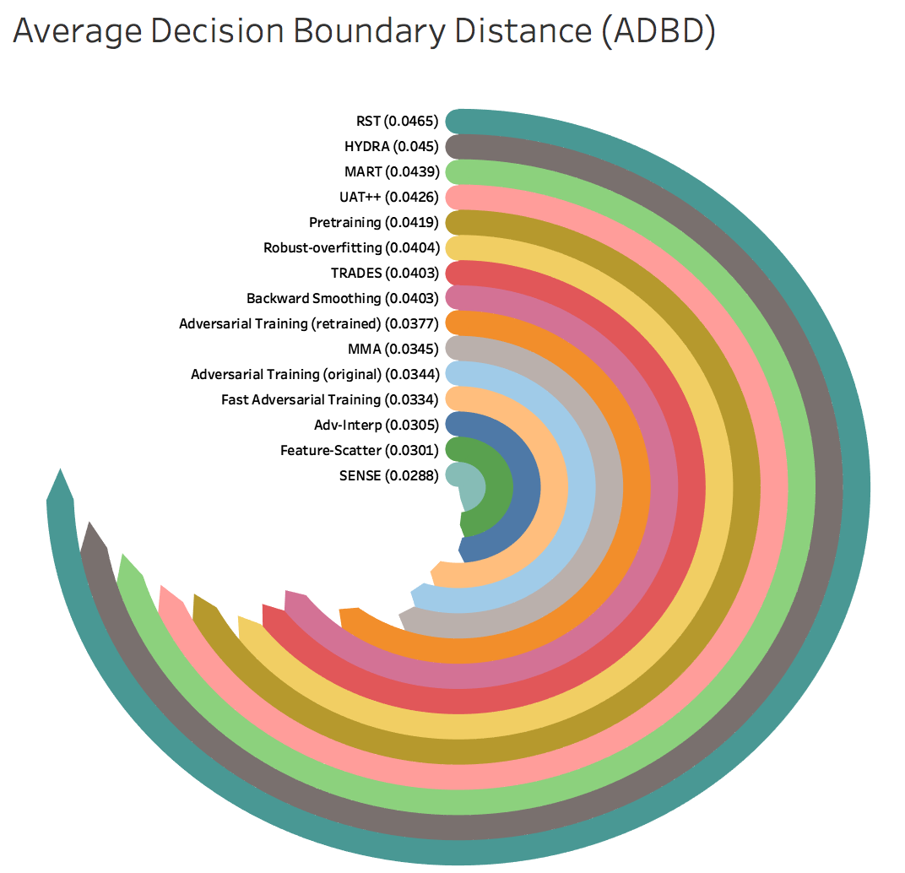

# RayS: A Ray Searching Method for Hard-label Adversarial Attack (KDD2020)
"RayS: A Ray Searching Method for Hard-label Adversarial Attack"\
*[Jinghui Chen](https://jinghuichen.github.io)*, *[Quanquan Gu](http://web.cs.ucla.edu/~qgu/)*\
[https://arxiv.org/abs/2006.12792](https://arxiv.org/abs/2006.12792)

This repository contains our PyTorch implementation of RayS: A Ray Searching Method for Hard-label Adversarial Attack in the paper [RayS: A Ray Searching Method for Hard-label Adversarial Attack](https://arxiv.org/abs/2006.12792) (accepted by KDD 2020). 

# What is RayS
RayS is a hard-label adversarial attack which only requires the target model's hard-label output (prediction label). 

**It is gradient-free, hyper-parameter free, and is also independent of adversarial losses such as CrossEntropy or C&W.**

Therefore, RayS can be used as a good sanity check for possible "falsely robust" models (models that may overfit to certain types of gradient-based attacks and adversarial losses).

# Average Decision Boundary Distance (ADBD)
RayS also proposed a new model robustness metric: `ADBD` (average decision boundary distance), which reflects examples' average distance to their closest decision boundary.    

# Model Robustness: ADBD Leaderboard

We tested the robustness of recently proposed robust models which are trained on the CIFAR-10 dataset with the maximum L_inf norm perturbation strength  `epsilon=0.031` (8/255). The robustness is evaluated on the entire CIFAR-10 testset (10000 examples).

**Note**: 
* Ranking is based on the ADBD (average decision boundary distance) metric under RayS attack with the default query limit set as 40000. Reducing the query limit will accelerate the process but may lead to inaccurate ADBD value. For fast checking purpose, we recommend evaluating on subset of CIFAR-10 testset (e.g., 1000 examples).
* `*` denotes model using extra data for training. 
* `Robust Acc (RayS)` represents robust accuracy under RayS attack for L_inf norm perturbation strength `epsilon=0.031` (8/255). For truly robust models, this value could be larger than the reported value (using white-box attacks) due to the hard-label limitation. For the current best robust accuracy evaluation, please refers to [AutoAttack](https://github.com/fra31/auto-attack), which uses an ensemble of four white-box/black-box attacks. 
* `ADBD` represents our proposed Average Decision Boundary Distance metric, which is independent to the perturbation strength `epsilon`. It reflects the overall model robustness through the lens of decision boundary distance. `ADBD` can be served as a complement to the traditional robust accuracy metric. Furthermore, `ADBD` only depends on hard-label output and can be adopted for cases where back-propgation or even soft-labels are not available. 


|Method |Natural Acc |Robust Acc <br>(Reported) |Robust Acc <br>(RayS) | ADBD|
|:---:|---:|---:|---:|---:|
| [WAR <br>(Wu et al., 2020)](https://arxiv.org/abs/2010.01279)*|  85.6| 59.8| 63.2| 0.0480|
| [RST <br>(Carmon et al., 2019)](https://arxiv.org/abs/1905.13736)*|  89.7| 62.5| 64.6| 0.0465|
| [HYDRA <br>(Sehwag et al., 2020)](https://arxiv.org/abs/2002.10509)*| 89.0| 57.2| 62.1| 0.0450|
| [MART <br>(Wang et al., 2020)](https://openreview.net/forum?id=rklOg6EFwS)*| 87.5| 65.0| 62.2| 0.0439|
| [UAT++ <br>(Alayrac et al., 2019)](https://arxiv.org/abs/1905.13725)*| 86.5| 56.3| 62.1| 0.0426|
| [Pretraining <br>(Hendrycks et al., 2019)](https://arxiv.org/abs/1901.09960)*| 87.1| 57.4| 60.1| 0.0419|
| [Robust-overfitting <br>(Rice et al., 2020)](https://arxiv.org/abs/2002.11569)| 85.3 | 58.0 | 58.6 | 0.0404|
| [TRADES <br>(Zhang et al., 2019b)](https://arxiv.org/abs/1901.08573)| 85.4| 56.4| 57.3| 0.0403| 
| [Backward Smoothing <br>(Chen et al., 2020)](https://arxiv.org/abs/2010.01278)| 85.3| 54.9| 55.1| 0.0403| 
| [Adversarial Training (retrained) <br>(Madry et al., 2018)](https://arxiv.org/abs/1706.06083)| 87.4| 50.6| 54.0| 0.0377| 
| [MMA <br>(Ding et al., 2020)](https://openreview.net/forum?id=HkeryxBtPB)| 84.4| 47.2| 47.7| 0.0345|
| [Adversarial Training (original) <br>(Madry et al., 2018)](https://arxiv.org/abs/1706.06083)| 87.1| 47.0| 50.7| 0.0344| 
| [Fast Adversarial Training <br>(Wong et al., 2020)](https://arxiv.org/abs/2001.03994)| 83.8| 46.1| 50.1 | 0.0334|
| [Adv-Interp <br> (Zhang & Xu, 2020)](https://openreview.net/forum?id=Syejj0NYvr&noteId=Syejj0NYvr) | 91.0| 68.7| 46.9| 0.0305|
| [Feature-Scatter <br> (Zhang & Wang, 2019)](http://papers.nips.cc/paper/8459-defense-against-adversarial-attacks-using-feature-scattering-based-adversarial-training)|  91.3| 60.6| 44.5| 0.0301|
| [SENSE <br>(Kim & Wang, 2020)](https://openreview.net/forum?id=rJlf_RVKwr)| 91.9| 57.2| 43.9| 0.0288| 
 

<p align="center">
    
</p>
 

Please contact us if you want to add your model to the leaderboard.


## How to use RayS to evaluate your model robustness:

### Prerequisites: 
* Python
* Numpy
* CUDA

### PyTorch models
Import RayS attack by 

```python
from general_torch_model import GeneralTorchModel
torch_model = GeneralTorchModel(model, n_class=10, im_mean=None, im_std=None)

from RayS import RayS
attack = RayS(torch_model, epsilon=args.epsilon)
```

where:
+ `torch_model` is the PyTorch model under GeneralTorchModel warpper; For models using transformed images (exceed the range of [0,1]), simply set `im_mean=[0.5, 0.5, 0.5]` and `im_std=[0.5, 0.5, 0.5]` for instance,
+ `epsilon` is the maximum adversarial perturbation strength.

To actually run RayS attack, use

```python
x_adv, queries, adbd, succ = attack(data, label, query_limit)
```

it returns:
+ `x_adv`: the adversarial examples found by RayS,
+ `queries`: the number of queries used for finding the adversarial examples,
+ `adbd`: the average decision boundary distance for each example,
+ `succ`: indicate whether each example being successfully attacked.


* Sample usage on attacking a robust model:
```bash
  -  python3 attack_robust.py --dataset rob_cifar_trades --query 40000 --batch 1000  --epsilon 0.031
```
+ You can also use `--num 1000` argument to limit the number of examples to be attacked as 1000. Default `num` is set as 10000 (the whole CIFAR10 testset).

### TensorFlow models
To evaluate TensorFlow models with RayS attack:

```python
from general_tf_model import GeneralTFModel 
tf_model = GeneralTFModel(model.logits, model.x_input, sess, n_class=10, im_mean=None, im_std=None)

from RayS import RayS
attack = RayS(tf_model, epsilon=args.epsilon)
```

where:
+ `model.logits`: logits tensor return by the Tensorflow model,
+ `model.x_input`: placeholder for model input (NHWC format),
+ `sess`: TF session .

The remaining part is the same as evaluating PyTorch models.

 

## Reproduce experiments in the paper:
* Run attacks on a naturally trained model (Inception):
```bash
  -  python3 attack_natural.py --dataset inception --epsilon 0.05
```
* Run attacks on a naturally trained model (Resnet):
```bash
  -  python3 attack_natural.py --dataset resnet --epsilon 0.05
```
* Run attacks on a naturally trained model (Cifar):
```bash
  - python3 attack_natural.py --dataset cifar --epsilon 0.031
```
* Run attacks on a naturally trained model (MNIST):
```bash
  - python3 attack_natural.py --dataset mnist --epsilon 0.3
```


## Citation
Please check our paper for technical details and full results. 

```
@inproceedings{chen2020rays,
  title={RayS: A Ray Searching Method for Hard-label Adversarial Attack},
  author={Chen, Jinghui and Gu, Quanquan},
  booktitle={Proceedings of the 26rd ACM SIGKDD International Conference on Knowledge Discovery and Data Mining},
  year={2020}
}
```

## Contact
If you have any question regarding RayS attack or the ADBD leaderboard above, please contact jinghuic@ucla.edu, enjoy!